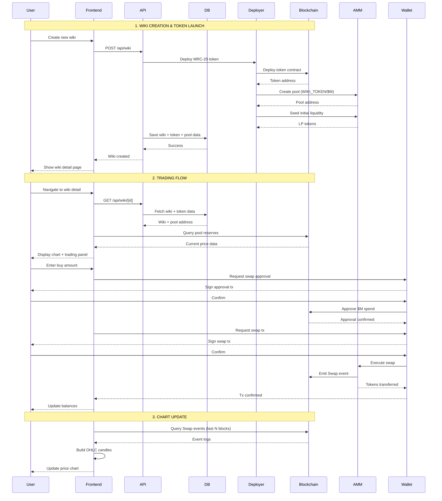

# Wiki Memecoin Trading Feature - Technical Specification

## Overview

This document provides the complete technical specification for implementing Pump.fun-style trading for wiki memecoins on the Memekipedia platform.

---

## 1. Architecture Diagram & Sequence Flow

### System Architecture

```
┌─────────────────────────────────────────────────────────────────────┐
│                         MEMEKIPEDIA PLATFORM                         │
├─────────────────────────────────────────────────────────────────────┤
│                                                                       │
│  ┌──────────────┐      ┌─────────────┐      ┌──────────────┐       │
│  │   Wiki DB    │◄────►│  API Routes │◄────►│  Frontend    │       │
│  │  (Supabase)  │      │  (Next.js)  │      │  Components  │       │
│  └──────────────┘      └─────────────┘      └──────────────┘       │
│         │                     │                      │               │
│         │                     │                      │               │
│         └─────────────────────┴──────────────────────┘               │
│                               │                                      │
└───────────────────────────────┼──────────────────────────────────────┘
                                │
                                ▼
┌─────────────────────────────────────────────────────────────────────┐
│                    BLOCKCHAIN LAYER (Memecore)                       │
├─────────────────────────────────────────────────────────────────────┤
│                                                                       │
│  ┌────────────┐     ┌────────────┐     ┌─────────────────┐         │
│  │  MRC-20    │────►│  AMM Pool  │────►│  Swap Events    │         │
│  │  Token     │     │  Contract  │     │  (for charts)   │         │
│  └────────────┘     └────────────┘     └─────────────────┘         │
│                                                                       │
└─────────────────────────────────────────────────────────────────────┘
                                │
                                ▼
┌─────────────────────────────────────────────────────────────────────┐
│                         USER WALLET                                  │
│                    (RainbowKit + Wagmi)                              │
└─────────────────────────────────────────────────────────────────────┘
```

### Sequence Flow: Wiki Launch → Liquidity → Trading



---

## 2. Data Model Updates

### Wiki Table Schema Update

Add the following fields to the existing `wikis` table:

```sql
ALTER TABLE wikis
ADD COLUMN pool_address VARCHAR(42),
ADD COLUMN pool_created_at TIMESTAMP,
ADD COLUMN initial_liquidity_m VARCHAR(78),
ADD COLUMN initial_liquidity_token VARCHAR(78),
ADD COLUMN lp_tokens VARCHAR(78);
```

Updated TypeScript interface:

```typescript
export interface Wiki {
  id: string
  title: string
  category: string
  cid: string
  editor: string
  created_at: string
  updated_at: string

  // Token fields (existing)
  token_address?: string | null
  token_symbol?: string | null
  token_name?: string | null
  token_supply?: string | null
  deploy_tx_hash?: string | null
  token_network?: string | null

  // NEW: Pool fields
  pool_address?: string | null
  pool_created_at?: string | null
  initial_liquidity_m?: string | null
  initial_liquidity_token?: string | null
  lp_tokens?: string | null
}
```

---

## 3. Smart Contract Requirements

### A. MRC-20 Token Contract

**Location:** Already exists at `lib/memecore/token-deployer.ts`

**Required Functions:**
- `approve(spender, amount)` - Approve AMM to spend tokens
- `transfer(to, amount)` - Transfer tokens
- `balanceOf(account)` - Check balance
- `totalSupply()` - Get total supply

### B. AMM Pool Contract (Uniswap V2 Compatible)

**Contract Name:** `MemeSwapV2Pair`

**Required Functions:**

```solidity
// Pool creation
function createPair(address tokenA, address tokenB) external returns (address pair)

// Add liquidity
function addLiquidity(
    address tokenA,
    address tokenB,
    uint amountADesired,
    uint amountBDesired,
    uint amountAMin,
    uint amountBMin,
    address to,
    uint deadline
) external returns (uint amountA, uint amountB, uint liquidity)

// Swap
function swapExactTokensForTokens(
    uint amountIn,
    uint amountOutMin,
    address[] calldata path,
    address to,
    uint deadline
) external returns (uint[] memory amounts)

// Query reserves
function getReserves() external view returns (
    uint112 reserve0,
    uint112 reserve1,
    uint32 blockTimestampLast
)

// Events
event Swap(
    address indexed sender,
    uint amount0In,
    uint amount1In,
    uint amount0Out,
    uint amount1Out,
    address indexed to
)

event Sync(uint112 reserve0, uint112 reserve1)
```

### C. AMM Factory Contract

**Contract Name:** `MemeSwapV2Factory`

```solidity
function createPair(address tokenA, address tokenB) external returns (address pair)
function getPair(address tokenA, address tokenB) external view returns (address pair)
```

---

## 4. Configuration

### Environment Variables

Add to `.env.local`:

```bash
# Existing
MEMECORE_PRIVATE_KEY=0x...
MEMECORE_NETWORK=insectarium
MRC20_BYTECODE=0x...

# NEW: AMM Contracts
MEMESWAP_FACTORY_ADDRESS=0x...  # Deployed factory contract
MEMESWAP_ROUTER_ADDRESS=0x...   # Deployed router contract
M_TOKEN_ADDRESS=0x...            # Native $M token address on testnet

# NEW: Liquidity Settings
INITIAL_LIQUIDITY_M=100          # 100 $M per wiki launch
INITIAL_LIQUIDITY_TOKENS=500000  # 500k tokens (0.05% of 1B supply)
```

### Network Configuration Update

Update `lib/memecore/config.ts`:

```typescript
export const MEMESWAP_CONTRACTS = {
  insectarium: {
    factory: process.env.MEMESWAP_FACTORY_ADDRESS || '0x...',
    router: process.env.MEMESWAP_ROUTER_ADDRESS || '0x...',
    mToken: process.env.M_TOKEN_ADDRESS || '0x...',
  },
  mainnet: {
    factory: '0x...',
    router: '0x...',
    mToken: '0x...',
  },
} as const

export const LIQUIDITY_DEFAULTS = {
  initialM: process.env.INITIAL_LIQUIDITY_M || '100',
  initialTokens: process.env.INITIAL_LIQUIDITY_TOKENS || '500000',
}
```

---

## 5. Key Implementation Files

The following sections detail the code structure for implementing this feature.

### File Structure

```
lib/
  memecore/
    token-deployer.ts         # ✅ Exists - MRC-20 deployment
    pool-creator.ts           # 🆕 NEW - AMM pool creation & liquidity
    swap-service.ts           # 🆕 NEW - Swap execution
    event-indexer.ts          # 🆕 NEW - Query swap events
    chart-builder.ts          # 🆕 NEW - Build OHLC candles
    amm-abis.ts              # 🆕 NEW - AMM contract ABIs

components/
  wiki/
    trading-panel.tsx         # 🆕 NEW - Buy/Sell swap UI
    price-chart.tsx           # 🆕 NEW - TradingView chart
    token-stats.tsx           # 🆕 NEW - Token metrics display

app/
  api/
    wiki/
      route.ts               # ✅ Update - Add pool creation
      [id]/route.ts          # ✅ Update - Include pool data
    swap/
      route.ts               # 🆕 NEW - Execute swaps
      quote/route.ts         # 🆕 NEW - Get swap quotes
```

---

## 6. Trading Economics & Tokenomics

### Initial Supply & Distribution

- **Total Supply:** 1,000,000,000 tokens (1 billion)
- **Initial Liquidity Pool:** 500,000 tokens (0.05% of supply)
- **Paired with:** 100 $M (Memecore native token)
- **Initial Price:** 1 token = 0.0002 $M

### Liquidity Pool Model

- **Type:** Constant Product AMM (x * y = k)
- **Formula:** reserve_M × reserve_Token = k
- **Slippage:** Auto-calculated based on trade size vs reserves

### Platform Fees (Configurable)

Default fee structure:
- **Swap Fee:** 0.3% (standard Uniswap V2 model)
  - 0.25% → Liquidity providers
  - 0.05% → Platform treasury
- **Platform controls initial LP tokens** (can extract or burn later)

---

## 7. UI/UX Requirements

### Wiki Detail Page Layout

```
┌────────────────────────────────────────────────────────────────┐
│  Wiki Title                                      [Edit Button]  │
├─────────────────────────────────┬──────────────────────────────┤
│                                  │  TOKEN STATS                 │
│  WIKI CONTENT                    │  Price: $0.0002              │
│  (Existing MDX)                  │  Market Cap: $200            │
│                                  │  24h Volume: $50             │
│                                  │  Holders: 12                 │
│                                  ├──────────────────────────────┤
│                                  │  PRICE CHART                 │
│                                  │  ┌─────────────────────────┐│
│                                  │  │  [TradingView Chart]    ││
│                                  │  │  Candlesticks + Volume  ││
│                                  │  │  1H | 4H | 1D | 1W      ││
│                                  │  └─────────────────────────┘│
│                                  ├──────────────────────────────┤
│                                  │  TRADING PANEL               │
│                                  │  [Buy] [Sell]                │
│                                  │                              │
│                                  │  You pay: [____] $M          │
│                                  │  You get: [____] TOKEN       │
│                                  │                              │
│                                  │  Price: 0.0002 $M            │
│                                  │  Slippage: 1%                │
│                                  │                              │
│                                  │  [Connect Wallet] or [Swap]  │
│                                  │                              │
│                                  │  Balance: 1000 $M            │
│                                  │  Balance: 0 TOKEN            │
└─────────────────────────────────┴──────────────────────────────┘
```

### Trading Panel States

1. **Not Connected:** Show "Connect Wallet" button
2. **Connected - Insufficient Balance:** Disable swap, show error
3. **Connected - Needs Approval:** Show "Approve $M" button first
4. **Ready to Swap:** Show "Swap" button with estimated output
5. **Swapping:** Loading state with tx hash link
6. **Success:** Show success message, update balances

---

## 8. Security Considerations

### Platform Wallet Security

- **Private key storage:** Use environment variables (never commit)
- **Multi-sig consideration:** For mainnet, use multi-sig for deployer wallet
- **Funds separation:** Use dedicated wallet for token deployments

### Smart Contract Security

- **Reentrancy protection:** Use OpenZeppelin's ReentrancyGuard
- **Access control:** Only factory can create pools
- **Deadline checks:** All swaps must include deadline parameter
- **Slippage protection:** Users must set min output amounts

### Front-end Security

- **Input validation:** Validate all amounts before signing
- **Transaction simulation:** Show estimated output before swap
- **Error handling:** Gracefully handle failed transactions
- **Rate limiting:** Prevent spam on API endpoints

---

## 9. Performance Optimization

### Caching Strategy

```typescript
// Cache pool reserves for 10 seconds
const RESERVE_CACHE_TTL = 10_000

// Cache OHLC data for 1 minute
const CHART_CACHE_TTL = 60_000

// Cache token balances for 5 seconds
const BALANCE_CACHE_TTL = 5_000
```

### Event Indexing

- **Strategy:** Index swap events on-demand (not real-time initially)
- **Frequency:** Update chart data every 30 seconds
- **Range:** Query last 1000 blocks for recent data
- **Storage:** Cache OHLC data in Redis or in-memory

### Chart Rendering

- **Library:** Lightweight Charting Library (TradingView)
- **Update frequency:** 30 seconds for live trades
- **Data points:** Max 1000 candles loaded at once
- **Timeframes:** 5m, 15m, 1h, 4h, 1d

---

## 10. Testing Strategy

See **Section 14** for detailed end-to-end test checklist.

---

## 11. Deployment Checklist

### Phase 1: Smart Contracts (Testnet)

- [ ] Deploy MemeSwapV2Factory on Insectarium testnet
- [ ] Deploy MemeSwapV2Router on Insectarium testnet
- [ ] Get test $M tokens from faucet
- [ ] Test token deployment
- [ ] Test pool creation
- [ ] Test adding liquidity
- [ ] Test swaps
- [ ] Verify contracts on block explorer

### Phase 2: Backend Services

- [ ] Add pool creation service
- [ ] Add swap execution service
- [ ] Add event indexer
- [ ] Add OHLC builder
- [ ] Update wiki API routes
- [ ] Add swap API routes
- [ ] Test all endpoints

### Phase 3: Frontend Components

- [ ] Build TradingPanel component
- [ ] Build PriceChart component
- [ ] Build TokenStats component
- [ ] Integrate with wiki detail page
- [ ] Test wallet connection flow
- [ ] Test approval flow
- [ ] Test swap flow
- [ ] Test chart updates

### Phase 4: Integration Testing

- [ ] End-to-end flow test
- [ ] Load testing (multiple concurrent swaps)
- [ ] Error scenario testing
- [ ] Gas optimization verification
- [ ] Security audit (if budget allows)

---

## 12. Future Enhancements (Out of Scope for v1)

- Multi-hop swaps (TOKEN → $M → OTHER_TOKEN)
- Limit orders
- Liquidity provider interface for users
- Rewards/staking for LP providers
- Advanced charting (indicators, drawing tools)
- Order book view
- Trading competition/leaderboard
- Mobile app
- Cross-chain bridges

---

## 13. Resources & References

### Memecore Documentation
- Testnet Faucet: https://faucet.memecore.com/insectarium
- Developer Docs: https://docs.memecore.com/developer-guide
- Block Explorer: https://insectarium.blockscout.memecore.com/
- RPC URL: https://rpc.insectarium.memecore.net/

### AMM References
- Uniswap V2 Docs: https://docs.uniswap.org/contracts/v2/overview
- Uniswap V2 Core: https://github.com/Uniswap/v2-core
- Uniswap V2 Periphery: https://github.com/Uniswap/v2-periphery

### Trading Chart Libraries
- Lightweight Charts: https://tradingview.github.io/lightweight-charts/
- TradingView Advanced Charts: https://www.tradingview.com/HTML5-stock-forex-bitcoin-charting-library/

---

## 14. End-to-End Test Checklist

See next section for detailed test plan.
